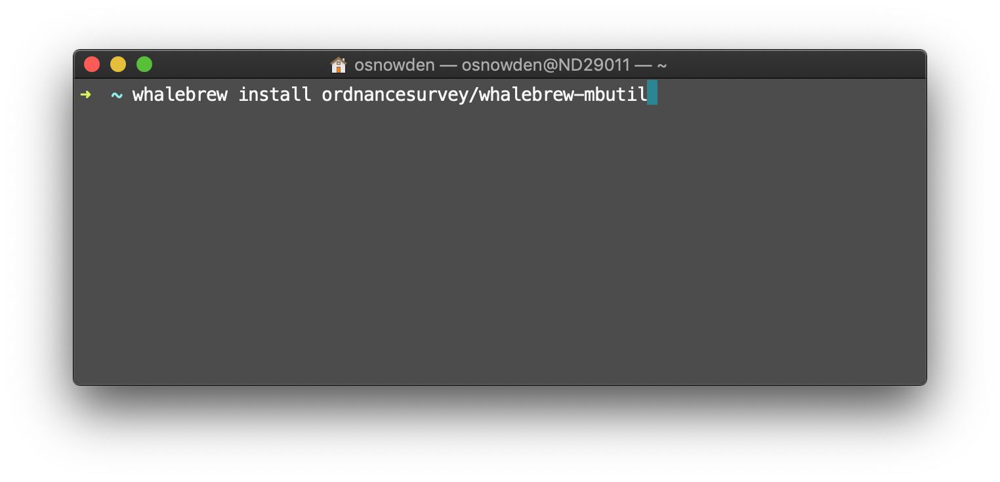
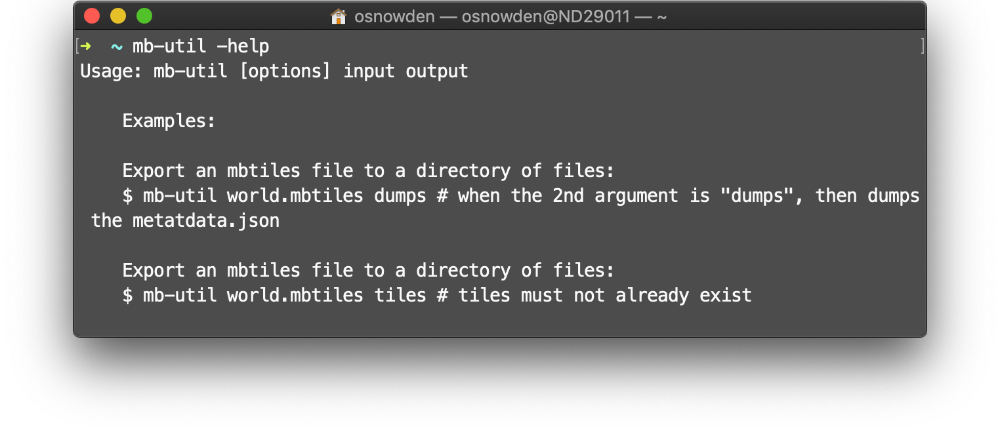

# mb-util command 

The mb-util command enables the extraction of [Mapbox mbtiles](https://github.com/mapbox/mbtiles-spec) to a directory.

For example, it might be useful to execute something like

```bash
./mb-util --image_format=pbf CTOffline_Terrain50_July15_v0.2.mbtiles terrain50
gzip -d -r -S .pbf *
find . -type f -exec mv '{}' '{}'.pbf \;
```

To simplify installation, a [whalebrew](https://github.com/whalebrew/whalebrew) Docker based container is provided.

Note: the [mb-util docker hub container](https://hub.docker.com/r/ordnancesurvey/whalebrew-mbutil) is built automatically from this repo.




